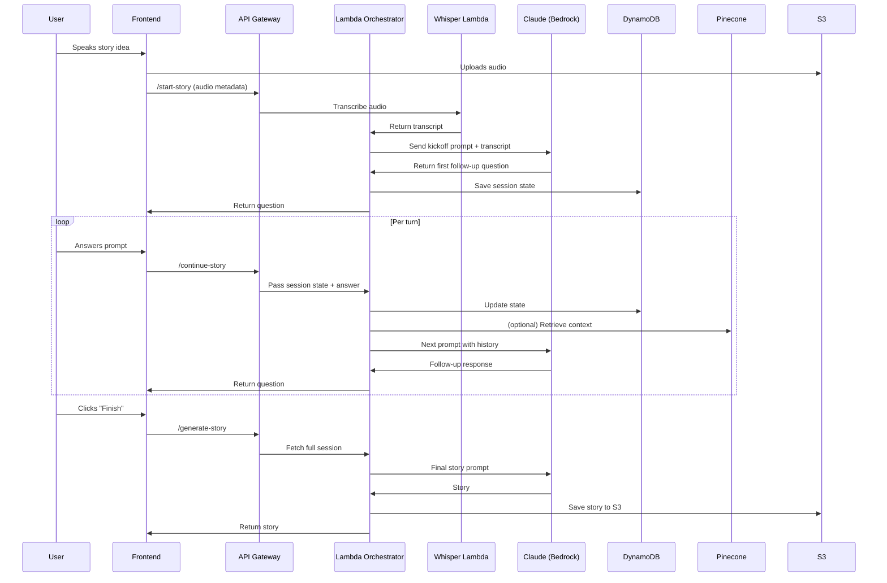

# 🔄 Session Lifecycle Documentation

This document outlines the complete session lifecycle for the Richmond Storyline Generator's conversational story development system.

---

## 🎯 Overview

The session lifecycle manages the complete user journey from initial voice input to final story delivery. It handles conversation state, LLM interactions, and data persistence throughout the multi-turn story development process.

---

## 🔄 Session Flow Overview



---

## 📋 Session Stages

### Stage 1: Session Initialization

**Trigger**: User provides initial voice input

**Process**:
1. **Audio Capture**: Frontend records user's voice memo
2. **Audio Upload**: Audio file uploaded to S3 bucket
3. **Session Creation**: POST to `/start-story` endpoint with audio metadata
4. **Transcription**: Whisper Lambda transcribes audio to text
5. **Depth Analysis**: Nova analyzes story depth and potential
6. **First Response**: Claude generates appropriate follow-up question
7. **State Persistence**: Session state saved to DynamoDB

**Data Flow**:
```
User Voice → S3 Upload → Whisper Transcription → Nova Analysis → Claude Response → DynamoDB
```

### Stage 2: Conversation Iteration

**Trigger**: User responds to follow-up questions

**Process**:
1. **Response Submission**: POST to `/continue-story` with user answer
2. **State Retrieval**: Load current session state from DynamoDB
3. **Context Enhancement**: Optionally retrieve relevant Richmond context from Pinecone
4. **Next Prompt**: Claude generates next question based on conversation history
5. **State Update**: Save updated session state to DynamoDB
6. **Response Delivery**: Return next question to frontend

**Data Flow**:
```
User Answer → DynamoDB Update → Context Retrieval → Claude Processing → State Save → Response
```

### Stage 3: Story Generation

**Trigger**: User indicates story is ready or system detects completion

**Process**:
1. **Session Retrieval**: Load complete conversation history from DynamoDB
2. **Prompt Assembly**: Combine all inputs into comprehensive story prompt
3. **Final Generation**: Claude generates complete story using all context
4. **Story Storage**: Save final story to S3
5. **Response Delivery**: Return complete story to frontend

**Data Flow**:
```
Complete Session → Prompt Assembly → Claude Generation → S3 Storage → Story Delivery
```

---

## 🗄️ Data Management

### Session State (DynamoDB)

**Table Structure**:
```json
{
  "session_id": "uuid-string",
  "created_at": "timestamp",
  "updated_at": "timestamp",
  "status": "active|completed|abandoned",
  "current_stage": "depth_analysis|follow_up|story_generation",
  "conversation_history": [
    {
      "turn": 1,
      "user_input": "voice transcript or text",
      "llm_response": "follow-up question or analysis",
      "timestamp": "timestamp",
      "stage": "depth_analysis"
    }
  ],
  "story_elements": {
    "core_idea": "original story idea",
    "depth_score": 3.5,
    "selected_hook": "user-selected hook",
    "narrative_arc": "developed story arc",
    "richmond_quote": "generated quote",
    "selected_cta": "user-selected CTA"
  },
  "final_story": "complete generated story",
  "metadata": {
    "user_id": "optional-user-id",
    "session_duration": "total time",
    "llm_calls": "number of LLM interactions"
  }
}
```

### File Storage (S3)

**Bucket Structure**:
```
storygen-assets/
├── audio/
│   └── {session_id}/
│       └── original_audio.wav
├── stories/
│   └── {session_id}/
│       ├── final_story.md
│       └── story_metadata.json
└── temp/
    └── {session_id}/
        └── processing_files
```

### Context Retrieval (Pinecone)

**Vector Search Process**:
1. **Query Embedding**: Convert user input to vector embedding
2. **Similarity Search**: Find most relevant Richmond context chunks
3. **Context Assembly**: Combine retrieved chunks for LLM context
4. **Relevance Scoring**: Rank context by relevance to current conversation

---

## 🔧 API Endpoints

### `/start-story` (POST)
**Purpose**: Initialize new story development session

**Request**:
```json
{
  "audio_metadata": {
    "bucket": "storygen-assets",
    "key": "audio/{session_id}/original_audio.wav",
    "content_type": "audio/wav"
  },
  "user_id": "optional-user-id"
}
```

**Response**:
```json
{
  "session_id": "uuid-string",
  "status": "active",
  "next_question": "Claude-generated follow-up question",
  "current_stage": "depth_analysis"
}
```

### `/continue-story` (POST)
**Purpose**: Continue conversation with user response

**Request**:
```json
{
  "session_id": "uuid-string",
  "user_response": "user's answer to previous question",
  "response_type": "text|voice"
}
```

**Response**:
```json
{
  "session_id": "uuid-string",
  "next_question": "next follow-up question",
  "current_stage": "follow_up",
  "conversation_progress": 0.6
}
```

### `/generate-story` (POST)
**Purpose**: Generate final story from complete session

**Request**:
```json
{
  "session_id": "uuid-string",
  "style": "short_post|long_post|blog_post"
}
```

**Response**:
```json
{
  "session_id": "uuid-string",
  "final_story": "complete generated story",
  "story_url": "s3-url-to-story-file",
  "metadata": {
    "word_count": 450,
    "generation_time": "2.3s",
    "context_chunks_used": 5
  }
}
```

---

## 🚀 Performance Considerations

### Latency Optimization
- **Async Processing**: Audio transcription and LLM calls handled asynchronously
- **Caching**: Frequently used Richmond context cached in memory
- **Connection Pooling**: Reuse LLM and database connections
- **Parallel Processing**: Context retrieval and LLM generation in parallel where possible

### Scalability
- **Stateless Design**: Lambda functions are stateless and scalable
- **Database Optimization**: DynamoDB auto-scaling and efficient indexing
- **CDN Integration**: S3 with CloudFront for fast file delivery
- **Load Balancing**: API Gateway handles traffic distribution

### Cost Optimization
- **LLM Token Management**: Optimize prompts to minimize token usage
- **Storage Lifecycle**: Automatic cleanup of temporary files
- **Caching Strategy**: Reduce redundant LLM calls and context retrievals
- **Resource Monitoring**: Track usage and optimize resource allocation

---

## 🔍 Monitoring & Analytics

### Key Metrics
- **Session Duration**: Time from start to story completion
- **Conversation Turns**: Number of interactions per session
- **LLM Response Time**: Average time for Claude/Nova responses
- **Success Rate**: Percentage of sessions that complete successfully
- **User Engagement**: Time spent in conversation vs. story quality

### Error Handling
- **Graceful Degradation**: Handle LLM failures with fallback responses
- **Session Recovery**: Resume interrupted sessions
- **Input Validation**: Validate user responses and handle edge cases
- **Retry Logic**: Automatic retries for transient failures

---

## 🔮 Future Enhancements

### Advanced Features
- **Real-time Collaboration**: Multiple users working on same story
- **Story Templates**: Pre-defined story structures and themes
- **Voice Synthesis**: Convert final stories to audio narration
- **Multi-modal Input**: Support for images and other media types

### Analytics & Insights
- **Story Quality Scoring**: Automated assessment of generated stories
- **User Behavior Analysis**: Understand conversation patterns
- **A/B Testing**: Test different prompt strategies
- **Community Feedback**: Allow users to rate and comment on stories
