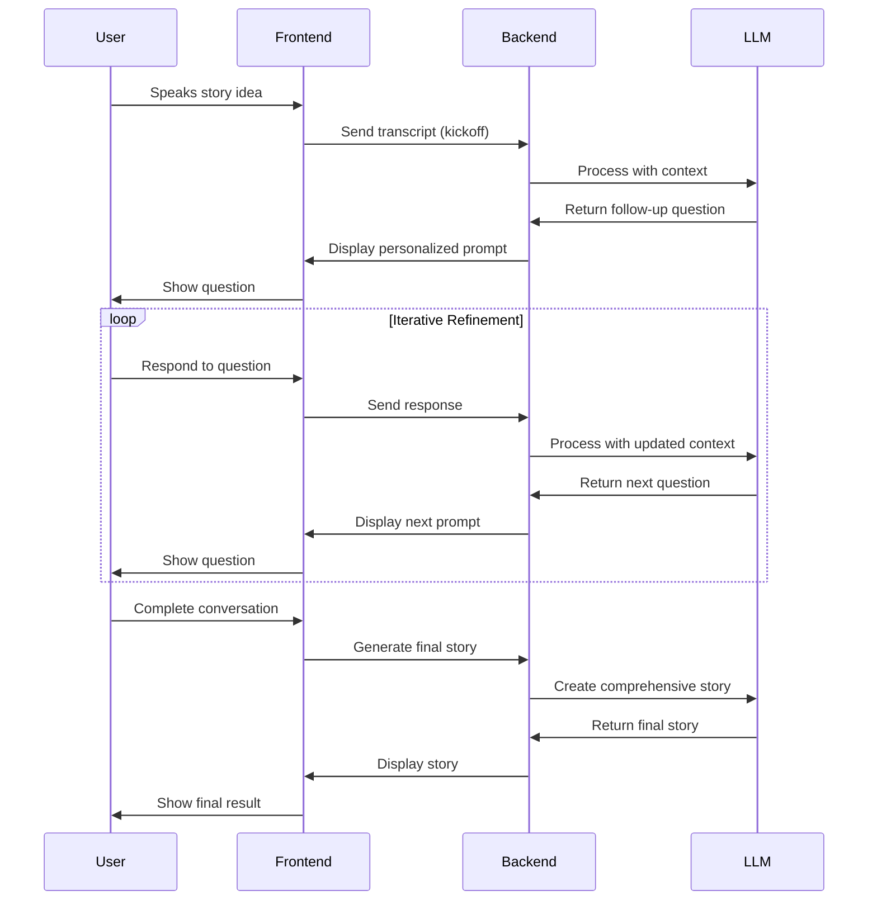
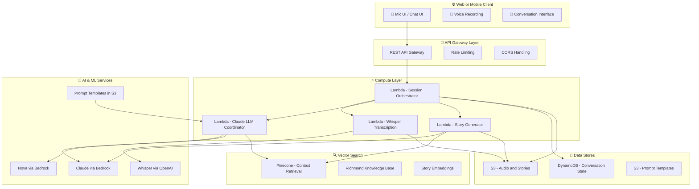

# 🎨 UX Strategy & Architecture Guide

*Comprehensive user experience and technical architecture strategy for the Richmond Storyline Generator*

---

## 🎯 Overview

This document outlines the user experience strategy and technical architecture for the Richmond Storyline Generator, focusing on creating an intuitive, engaging, and technically robust conversational storytelling platform.

---

## 🔄 Frontend Interaction Flow

### 🏆 **Recommended Approach: Hybrid Iterative Interaction Pattern**

Our recommended UX pattern balances user engagement with technical efficiency through iterative, adaptive conversations.

#### **Flow Overview**



#### **Step-by-Step Process**

1. **🎤 Voice Input**: User speaks their story idea
2. **🔊 Transcription**: Voice is transcribed via Whisper
3. **🧠 Analysis**: Backend processes with Nova for depth analysis
4. **💬 Follow-up**: LLM generates personalized follow-up question
5. **🔄 Iteration**: User responds, system adapts with new context
6. **📝 Generation**: After N steps, final story is generated
7. **✏️ Refinement**: Optional editing, branching, or alternate endings

### ✅ **Advantages**

- **🎯 High Engagement**: Feels alive and intelligent with each adaptive question
- **⚡ Optimized Latency**: Each turn is lightweight, avoiding long generation delays
- **🛠️ Error Recovery**: Easy to re-ask or rephrase at any step
- **🔧 Extensibility**: Supports branching stories, real-time feedback, emotional tone control
- **📊 Observability**: Easier to log and debug at the step level
- **🎨 Personalization**: Each question builds on previous responses

### ⚠️ **Considerations**

- **🗄️ Session State**: Requires persistent state management across turns
- **📡 API Complexity**: More API calls, potentially higher infrastructure complexity
- **🎭 UI Indicators**: Needs clear loading states and stage transition indicators
- **💾 State Management**: Requires robust conversation state persistence

---

## 🏗️ Backend AWS Architecture

### **High-Level Architecture Diagram**



### **Component Breakdown & Rationale**

#### 🎯 **API Gateway + Lambda Architecture**

**Why This Approach:**
- **🔧 Simple Management**: Easy per-route logic handling (transcribe, next-prompt, finalize)
- **📈 Scalability**: Scales well with low-cost on-demand usage
- **🔗 Integration**: Seamless integration with Bedrock and Pinecone
- **🛡️ Security**: Built-in authentication, authorization, and rate limiting

**Implementation:**
```yaml
API Routes:
  POST /story/start: Initialize new story session
  POST /story/continue: Continue conversation
  POST /story/generate: Generate final story
  GET /story/{id}: Retrieve story
  DELETE /story/{id}: Delete story
```

#### 🧠 **LLM Orchestration Lambda**

**Responsibilities:**
- **🎭 Central Coordination**: Manages each story development stage
- **🗄️ State Management**: Handles current state lookup from DynamoDB
- **🔍 Context Injection**: Retrieves relevant context from Pinecone
- **📝 Prompt Generation**: Generates prompts using Bedrock
- **🔄 Flow Control**: Manages conversation progression and branching

**Key Features:**
- **🕐 Timeout Management**: Handles LLM response timeouts gracefully
- **🔄 Retry Logic**: Implements exponential backoff for failed requests
- **📊 Logging**: Comprehensive logging for debugging and analytics
- **🎯 Error Handling**: Graceful degradation for service failures

#### 📒 **Prompt Templates in S3**

**Benefits:**
- **📝 Version Control**: Maintain prompt templates with versioning
- **🎨 Dynamic Selection**: Select different templates per stage or genre
- **🔧 Easy Updates**: Update prompts without code deployment
- **📊 A/B Testing**: Test different prompt variations

**Structure:**
```
s3://storygen-prompts/
├── conversation/
│   ├── depth_analysis.json
│   ├── follow_up_questions.json
│   └── personal_impact.json
├── story_generation/
│   ├── hook_generation.json
│   ├── arc_development.json
│   └── final_story.json
└── templates/
    ├── short_post.json
    ├── long_post.json
    └── blog_post.json
```

#### 🧭 **Conversation State in DynamoDB**

**Data Model:**
```json
{
  "session_id": "uuid-string",
  "user_id": "optional-user-id",
  "created_at": "timestamp",
  "updated_at": "timestamp",
  "status": "active|completed|abandoned",
  "current_stage": "depth_analysis|follow_up|story_generation",
  "conversation_history": [
    {
      "turn": 1,
      "user_input": "voice transcript or text",
      "llm_response": "follow-up question or analysis",
      "timestamp": "timestamp",
      "stage": "depth_analysis",
      "context_used": ["richmond_quotes", "richmond_culture"]
    }
  ],
  "story_elements": {
    "core_idea": "original story idea",
    "depth_score": 3.5,
    "selected_hook": "user-selected hook",
    "narrative_arc": "developed story arc",
    "richmond_quote": "generated quote",
    "selected_cta": "user-selected CTA"
  },
  "final_story": "complete generated story",
  "metadata": {
    "session_duration": "total time",
    "llm_calls": "number of LLM interactions",
    "context_chunks_retrieved": "number of context chunks used"
  }
}
```

**Features:**
- **🔄 Resumability**: Enable resuming interrupted sessions
- **🌳 Branching**: Support multiple story paths
- **↩️ Undo**: Allow users to go back and revise
- **📊 Analytics**: Track user behavior and story quality

#### 🧬 **Pinecone Vector Search**

**Content Types:**
- **📚 Past Stories**: Vectorized versions of previous stories
- **📖 Reference Documents**: Richmond context and knowledge base
- **🎭 Genre Context**: Story templates and narrative patterns
- **😊 Emotion/Mood Data**: Sentiment and tone vectors

**Retrieval Strategy:**
- **🎯 Per-Turn Retrieval**: Retrieve relevant context for each conversation turn
- **📈 Coherence Improvement**: Use context to improve story coherence
- **💡 Inspiration**: Provide creative inspiration from similar stories
- **🏙️ Local Relevance**: Ensure Richmond-specific context integration

#### 🧾 **Audio & Story Assets in S3**

**Storage Structure:**
```
s3://storygen-assets/
├── audio/
│   └── {session_id}/
│       ├── original_audio.wav
│       └── processed_audio.mp3
├── stories/
│   └── {session_id}/
│       ├── final_story.md
│       ├── story_metadata.json
│       └── audio_version.mp3
└── temp/
    └── {session_id}/
        └── processing_files
```

**Features:**
- **🎵 Audio Playback**: Store original voice recordings for playback
- **📝 Story Versions**: Multiple versions of the same story
- **🎨 Audio Stories**: Generate audio versions of final stories
- **🗂️ Organization**: Clear structure for easy asset management

---

## ✅ Best Practices

### **🎯 User Experience**

- **🎭 Clear Role Definition**: Use Claude system prompts to enforce structure
- **⏱️ Responsive Design**: Add timeouts and retries around service calls
- **📊 Comprehensive Logging**: Log each step input/output for debugging
- **💾 Smart Caching**: Cache common Pinecone queries (themes, genres)
- **🎮 Flexible Navigation**: Provide "skip this question" or "back" UX options
- **🎨 Visual Feedback**: Clear loading states and progress indicators

### **🏗️ Technical Architecture**

- **🔄 State Synchronization**: Store and sync conversation backend-side
- **⚡ Incremental Processing**: Avoid batching everything at once
- **📝 Declarative Prompts**: Keep prompt logic in JSON/YAML templates
- **🛡️ Error Handling**: Graceful degradation for service failures
- **📈 Monitoring**: Comprehensive metrics and alerting
- **🔒 Security**: Proper authentication and authorization

### **🎨 Interface Design**

- **🎤 Voice-First**: Optimize for voice input and natural conversation
- **📱 Mobile-First**: Ensure excellent mobile experience
- **♿ Accessibility**: Follow WCAG guidelines for inclusivity
- **🌙 Dark Mode**: Support both light and dark themes
- **📊 Progress Indicators**: Show conversation progress and completion
- **🎯 Clear CTAs**: Obvious next steps and actions

---

## ❌ Common Pitfalls to Avoid

### **🚫 Technical Mistakes**

- **💾 Frontend-Only State**: Don't rely solely on frontend state management
- **📦 Over-Batching**: Avoid batching everything at once—kills creativity
- **🔧 Hard-Coded Logic**: Don't hard-code prompt logic in application code
- **⏰ Ignoring Latency**: Don't ignore user experience during long operations
- **🔄 Poor Error Recovery**: Don't fail silently—provide clear error messages

### **🎨 UX Mistakes**

- **🎭 Unclear Expectations**: Don't leave users guessing about next steps
- **📱 Poor Mobile Experience**: Don't neglect mobile optimization
- **🎯 Confusing Navigation**: Don't make it hard to go back or skip steps
- **📊 No Progress Feedback**: Don't leave users in the dark about progress
- **🎨 Inconsistent Design**: Don't mix different design patterns

### **🏗️ Architectural Mistakes**

- **🗄️ Poor State Management**: Don't lose conversation state
- **📡 Service Coupling**: Don't tightly couple services
- **🔒 Security Oversights**: Don't forget proper authentication
- **📊 Missing Monitoring**: Don't deploy without observability
- **💰 Cost Optimization**: Don't ignore cost implications

---

## 🚀 Implementation Roadmap

### **Phase 1: Core Infrastructure** ✅
- [x] Basic API endpoints
- [x] Lambda function setup
- [x] DynamoDB table design
- [x] S3 bucket configuration

### **Phase 2: Conversation Flow** 🚧
- [ ] Session management
- [ ] Conversation state persistence
- [ ] LLM integration
- [ ] Context retrieval

### **Phase 3: User Interface** 📋
- [ ] Voice recording interface
- [ ] Conversation UI
- [ ] Progress indicators
- [ ] Mobile optimization

### **Phase 4: Advanced Features** 🔮
- [ ] Story editing capabilities
- [ ] Branching narratives
- [ ] Audio story generation
- [ ] Community features

---

## 📊 Success Metrics

### **🎯 User Engagement**
- **⏱️ Session Duration**: Average time spent in conversation
- **🔄 Completion Rate**: Percentage of sessions that complete
- **📈 Return Rate**: Users who come back for more stories
- **⭐ Satisfaction Score**: User feedback and ratings

### **🏗️ Technical Performance**
- **⚡ Response Time**: Average LLM response time
- **🔄 Success Rate**: Percentage of successful API calls
- **💰 Cost Efficiency**: Cost per story generated
- **📊 Error Rate**: Percentage of failed operations

### **🎨 User Experience**
- **🎤 Voice Quality**: Transcription accuracy
- **💬 Conversation Flow**: Natural conversation progression
- **📱 Mobile Experience**: Mobile usability scores
- **♿ Accessibility**: Accessibility compliance scores

---

*This UX strategy ensures the Richmond Storyline Generator provides an intuitive, engaging, and technically robust experience for creating compelling Richmond stories.*

