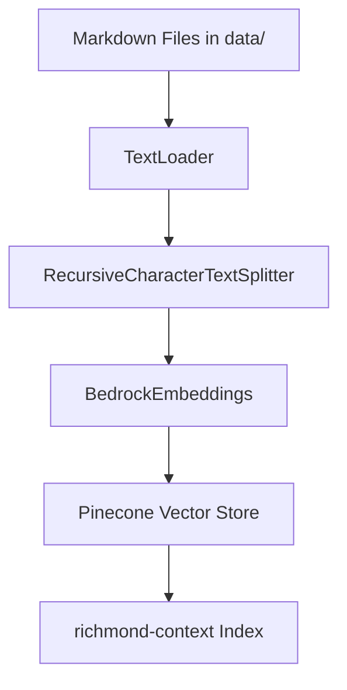
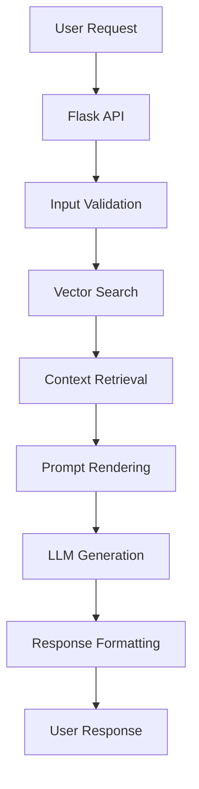

# 🔄 Richmond Storyline Generator - Workflow Documentation

This document explains the complete process flow of how the Richmond Storyline Generator API functions behind the scenes, from initial setup to story generation.

---

## 📋 Overview

The Richmond Storyline Generator is a multi-stage pipeline that transforms a user's core idea into a contextualized narrative about Richmond's tech scene. The system combines vector search, LLM generation, and curated local knowledge to create compelling stories.

---

## 🏗️ Architecture Components

### 1. **Data Layer**
- **Pinecone Vector Database**: Stores embedded chunks of Richmond context documents
- **Local Data Files**: Markdown files containing Richmond-specific information
- **Document Types**: Quotes, Culture, Economy, Stories, and News

### 2. **Processing Layer**
- **Vector Search**: Semantic retrieval of relevant context
- **LLM Generation**: Claude 3 Sonnet via Amazon Bedrock
- **Prompt Engineering**: Jinja2 templated prompts

### 3. **API Layer**
- **Flask Web Server**: RESTful endpoint for story generation
- **Request Handling**: Input validation and response formatting

---

## 🔄 Complete Workflow Process

### Phase 1: Data Ingestion (One-time Setup)



**Process:**
1. **Document Loading**: All `.md` files in the `data/` directory are loaded using LangChain's `TextLoader`
2. **Text Chunking**: Documents are split into 1000-character chunks with 100-character overlap using `RecursiveCharacterTextSplitter`
3. **Embedding Generation**: Each chunk is converted to vector embeddings using Amazon Bedrock's embedding model
4. **Vector Storage**: Embeddings are stored in Pinecone's `richmond-context` index

**Command:**
```bash
python ingestion/ingest_docs.py
```

### Phase 2: Story Generation (Real-time)



**Process Flow:**

#### Step 1: Request Handling
- **Endpoint**: `POST /generate-story`
- **Input Validation**: Ensures `core_idea` is provided
- **Style Selection**: Defaults to `short_post` if not specified
- **Supported Styles**: `short_post`, `long_post`, `blog_post`

#### Step 2: Context Retrieval
- **Query Processing**: The user's `core_idea` is used as the search query
- **Vector Search**: Pinecone performs similarity search using the query embedding
- **Top-K Retrieval**: Returns the 5 most relevant document chunks
- **Context Assembly**: Retrieved chunks are concatenated into a single context string

#### Step 3: Prompt Engineering
- **Template Loading**: Jinja2 template from `prompts/story_prompt.txt` is loaded
- **Variable Substitution**: 
  - `{{ core_idea }}`: User's input idea
  - `{{ retrieved_chunks }}`: Retrieved context
  - `{{ style }}`: Output format (short_post/long_post/blog_post)
- **Prompt Rendering**: Final prompt is assembled with all variables

#### Step 4: LLM Generation
- **Model Selection**: Claude 3 Sonnet (`anthropic.claude-3-sonnet-20240229-v1:0`)
- **Token Limits**: 
  - `short_post`: 1024 tokens
  - `long_post`: 2048 tokens  
  - `blog_post`: 4096 tokens
- **Temperature**: 0.7 (balanced creativity and consistency)
- **Response Processing**: JSON response is parsed to extract the completion

#### Step 5: Response Delivery
- **JSON Formatting**: Story is wrapped in JSON response
- **Error Handling**: Appropriate HTTP status codes for different scenarios

---

## 🧠 Prompt Structure

The system uses a structured prompt template that guides the LLM to:

1. **Role Definition**: Act as a civic storyteller from Richmond, Virginia
2. **Output Format**: Generate content in the specified style (short/long post or blog)
3. **Story Structure**: Follow a 5-step narrative framework:
   - Introduce the core idea
   - Explain Richmond relevance
   - Weave in 5 types of context:
     - Richmond figure quote
     - Cultural insight
     - Economic insight
     - Lesser-known Richmond story
     - Recent news item
   - Include call to action
   - Thoughtful conclusion

---

## 🔧 Technical Implementation Details

### Vector Search Configuration
- **Index Name**: `richmond-context`
- **Environment**: `us-east1-gcp`
- **Search Method**: Similarity search with cosine distance
- **Results Count**: Top 5 most relevant chunks

### LLM Configuration
- **Provider**: Amazon Bedrock
- **Model**: Claude 3 Sonnet
- **Region**: `us-east-1`
- **Content Type**: JSON
- **Response Format**: Structured completion

### API Configuration
- **Framework**: Flask
- **Port**: 5000 (development)
- **Debug Mode**: Enabled for development
- **Content Type**: JSON requests/responses

---

## 📊 Data Flow Diagram

```
User Input (core_idea + style)
    ↓
Flask API Validation
    ↓
Pinecone Vector Search
    ↓
Context Retrieval (5 chunks)
    ↓
Jinja2 Prompt Template
    ↓
Claude 3 Sonnet (Bedrock)
    ↓
Story Generation
    ↓
JSON Response
    ↓
User Receives Story
```

---

## 🔍 Error Handling

### Input Validation
- **Missing core_idea**: Returns 400 Bad Request
- **Invalid style**: Defaults to `short_post`

### Service Dependencies
- **Pinecone Connection**: Handled by Pinecone client
- **Bedrock Access**: Managed by AWS SDK
- **Template Loading**: File system error handling

---

## 🚀 Performance Considerations

### Optimization Strategies
- **Vector Search**: Efficient similarity search with pre-computed embeddings
- **Token Limits**: Appropriate limits for each output style
- **Context Window**: Balanced chunk size (1000 chars) for relevance vs. completeness
- **Caching**: No current caching, but vector store provides fast retrieval

### Scalability
- **Stateless Design**: Each request is independent
- **Cloud Services**: Leverages AWS Bedrock and Pinecone for scalability
- **Modular Architecture**: Easy to extend with additional components

---

## 🔄 Maintenance Workflow

### Regular Tasks
1. **Data Updates**: Add new Richmond context files to `data/` directory
2. **Re-ingestion**: Run `python ingestion/ingest_docs.py` after data changes
3. **Prompt Tuning**: Modify `prompts/story_prompt.txt` for different narrative styles
4. **Model Updates**: Update Bedrock model ID for newer versions

### Monitoring
- **API Health**: Check Flask server status
- **Vector Store**: Monitor Pinecone index health
- **LLM Performance**: Track response times and quality

---

This workflow ensures that every story generated is grounded in Richmond's authentic context while maintaining the flexibility to adapt to different narrative styles and user inputs. 